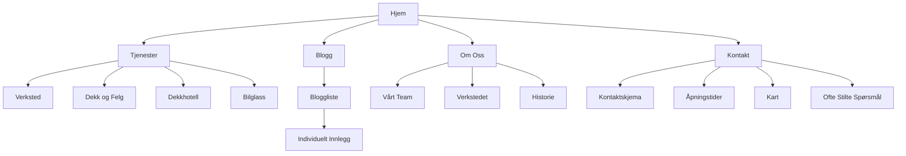
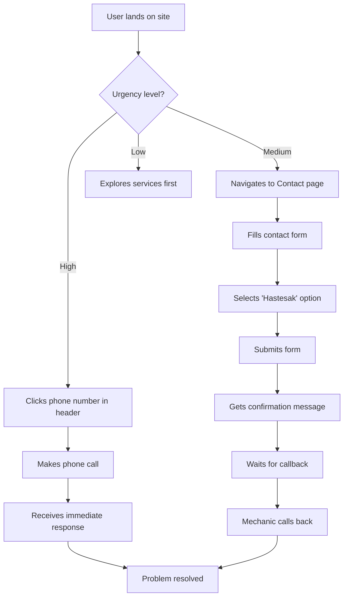
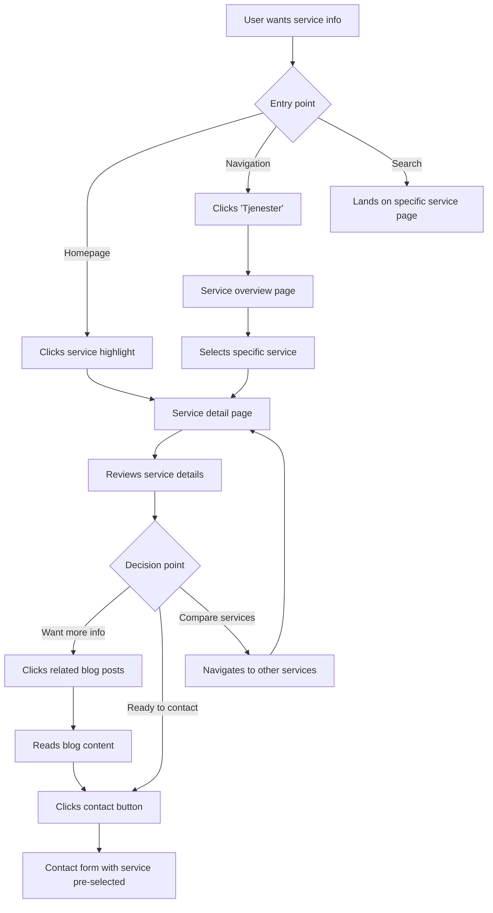
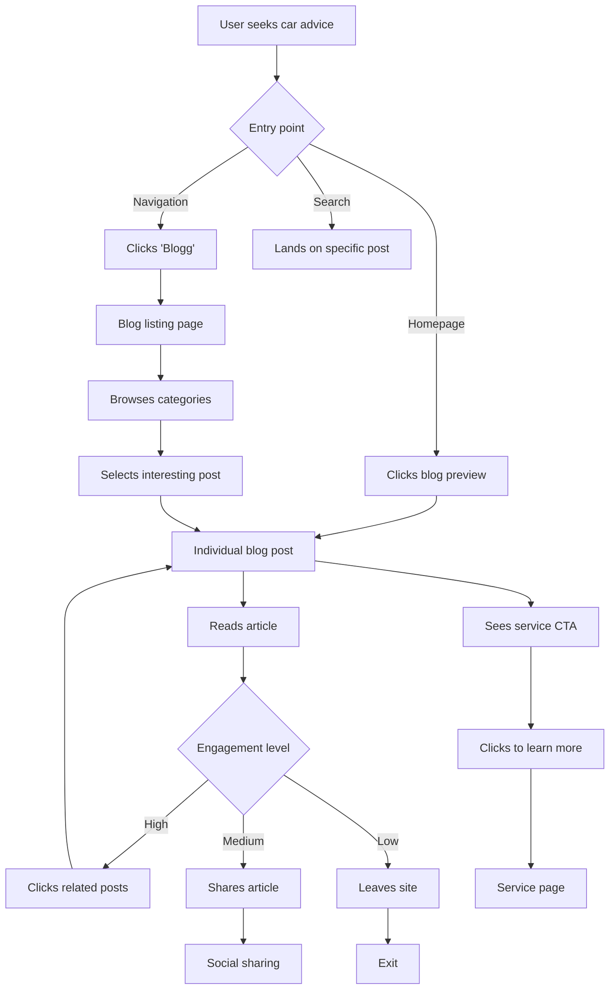
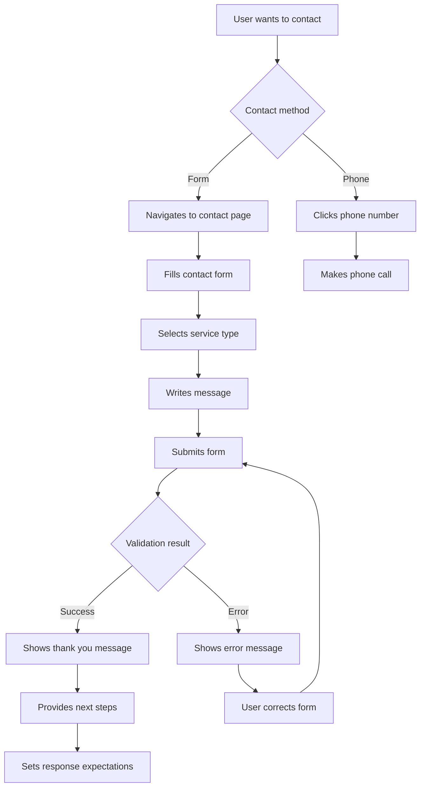

# Local Norwegian Car Mechanic Website UI/UX Specification

## Introduction

This document defines the user experience goals, information architecture, user flows, and visual design specifications for the Local Norwegian Car Mechanic Website's user interface. It serves as the foundation for visual design and frontend development, ensuring a cohesive and user-centered experience that embodies Norwegian "koselig" hospitality while maintaining professional credibility.

### Overall UX Goals & Principles

#### Target User Personas

1. **Local Norwegian Car Owner (Primary Persona):**
   - Age: 30-65, living in the local community
   - Needs: Convenient, trustworthy car maintenance without traveling to the city
   - Values: Practicality, reliability, personal service, community connection
   - Pain Points: Long travel times to city mechanics, impersonal service, higher costs
   - Tech Comfort: Moderate - uses smartphone for local searches, expects mobile-friendly sites

2. **Busy Professional (Secondary Persona):**
   - Age: 25-50, time-constrained, values efficiency
   - Needs: Quick service booking, clear communication, minimal hassle
   - Values: Time-saving, transparent pricing, digital convenience
   - Pain Points: Limited time for car maintenance, needs flexible scheduling
   - Tech Comfort: High - comfortable with digital booking and communication

3. **Elderly Community Member (Tertiary Persona):**
   - Age: 65+, long-time local resident
   - Needs: Trustworthy service, clear communication, personal connection
   - Values: Long-term relationships, personal recommendations, traditional service
   - Pain Points: Technology complexity, concerns about being taken advantage of
   - Tech Comfort: Low - prefers phone calls, needs simple website navigation

#### Usability Goals

- **Ease of finding services:** Users can locate relevant services within 3 clicks from homepage
- **Mobile-first efficiency:** Users can complete contact form submission on mobile in under 2 minutes
- **Trust establishment:** First-time visitors feel confident in the mechanic's credibility within 30 seconds
- **Local connection:** Users immediately understand this is a local Norwegian business with community values
- **Service clarity:** Users can quickly understand what services are offered and their benefits

#### Design Principles

1. **Koselig Hospitality First** - Every design element should convey the warmth and personal connection of Norwegian hospitality, from color choices to micro-interactions

2. **Professional Trust Through Transparency** - Build credibility through authentic imagery, clear information, and honest communication about services and pricing

3. **Mobile-First Local Search** - Optimize for users searching "bilverksted nær meg" on mobile devices, with immediate access to contact information

4. **Progressive Service Disclosure** - Start with high-level value propositions, then reveal detailed service information as users engage deeper

5. **Norwegian Cultural Authenticity** - Incorporate subtle visual elements that signal Norwegian values of practicality, reliability, and community connection

### Change Log

| Date | Version | Description | Author |
|------|---------|-------------|---------|
| 2025-10-01 | 1.0 | Initial UI/UX specification creation | Sally (UX Expert) |
## Information Architecture (IA)

### Site Map / Screen Inventory

### Navigation Structure

**Primary Navigation:**
- Horizontal top navigation with logo on left, menu items center/right
- Prominent phone number in header (click-to-call on mobile)
- Mobile: Hamburger menu that expands to full-screen overlay
- Items: Hjem, Tjenester, Blogg, Om Oss, Kontakt
- Mobile sticky "Ring nå" (Call now) button for emergency situations

**Secondary Navigation:**
- Service sub-navigation within Tjenester section with quick contact options
- Blog category filtering within Blogg section
- Footer navigation with quick links to important pages
- Quick contact buttons on all service pages

**Breadcrumb Strategy:**
- Simple breadcrumb trail for deeper service pages and blog posts
- Format: Hjem > Tjenester > Verksted
- Not needed on homepage or top-level pages

**Navigation Enhancements Based on User Journeys:**
- Phone number prominently displayed in header for emergency access
- Clear service-to-contact paths with pre-populated service types
- "Om Oss" section easily accessible for trust building
- Service pages optimized for direct search landing
- Estimated response time displayed on contact form

### User Journey Mapping

#### Journey 1: Local Norwegian Car Owner - Emergency Repair Need

**User:** Maria, 42, teacher living in the local community
**Situation:** Her car won't start this morning, needs immediate help

**Path:**
1. **Discovery:** Searches "bilverksted nær meg" on mobile phone
2. **Entry:** Lands on homepage via local search results
3. **First Impressions:** Sees hero section with local mechanic photo and "Din lokale bilpartner" messaging
4. **Navigation:** Immediately clicks phone number in header to call
5. **Alternative Path:** If no answer, clicks "Kontakt" in navigation
6. **Contact:** Finds contact form with emergency option and calls again
7. **Resolution:** Submits form with "Hastesak" (Urgent) selected

**Navigation Validation:** 
- ✅ Phone number prominently displayed in header
- ✅ Clear contact path from homepage
- ✅ Emergency option in contact form
- ✅ Mobile-optimized contact experience

#### Journey 2: Busy Professional - Scheduled Maintenance

**User:** Thomas, 35, software developer with limited time
**Situation:** Needs routine service but wants to schedule efficiently

**Path:**
1. **Discovery:** Remembers seeing local mechanic's Facebook post
2. **Entry:** Types website URL directly on desktop during lunch break
3. **Exploration:** Clicks "Tjenester" to understand offerings
4. **Service Selection:** Reviews "Verksted" service page
5. **Decision:** Clicks "Kontakt" button with service pre-selected
6. **Form Completion:** Fills contact form requesting appointment
7. **Confirmation:** Receives thank you message with expected response time

**Navigation Validation:**
- ✅ Clear service categorization under "Tjenester"
- ✅ Detailed service information available
- ✅ Direct path from service to contact
- ✅ Form pre-population with service type

#### Journey 3: Elderly Community Member - Trust Building

**User:** Bjørn, 72, retired farmer, long-time local resident
**Situation:** Looking for a trustworthy mechanic after city shop disappointment

**Path:**
1. **Discovery:** Recommended by neighbor at local grocery store
2. **Entry:** Has son help him access website on tablet
3. **Exploration:** Clicks "Om Oss" to learn about the business
4. **Trust Building:** Reads about mechanics, sees photos of workshop
5. **Service Review:** Clicks "Tjenester" to see what's offered
6. **Contact:** Prefers to call rather than use form
7. **Action:** Notes phone number from header and calls during business hours

**Navigation Validation:**
- ✅ "Om Oss" section provides trust-building information
- ✅ Clear service descriptions
- ✅ Phone number prominently displayed
- ✅ Simple, non-overwhelming navigation structure

#### Journey 4: Price-Conscious Student - Tire Change

**User:** Emma, 21, university student on tight budget
**Situation:** Needs seasonal tire change, looking for best value

**Path:**
1. **Discovery:** Searches "dekkhotell pris [byen]" on mobile
2. **Entry:** Lands on "Dekkhotell" service page via search
3. **Information Seeking:** Reviews service details and pricing information
4. **Comparison:** Clicks "Dekk og felg" to compare related services
5. **Decision:** Returns to "Dekkhotell" page to contact
6. **Contact:** Uses contact form with specific questions about pricing
7. **Follow-up:** Checks blog for "Spar penger på vedlikehold" tips

**Navigation Validation:**
- ✅ Direct access to specific service pages via search
- ✅ Easy navigation between related services
- ✅ Blog content supports decision making
- ✅ Contact form accessible from service pages

**Navigation Insights from Journey Mapping:**

1. **Phone Number Critical:** All journeys emphasize the importance of immediate phone access in header
2. **Service-to-Contact Path:** Clear navigation from service pages to contact is essential
3. **Trust Building Priority:** "Om Oss" section is crucial for new customer acquisition
4. **Mobile-First Reality:** Most critical journeys happen on mobile devices
5. **Direct Service Access:** Users often land directly on service pages via search

**Navigation Improvements Based on Journeys:**

1. Add sticky "Ring nå" (Call now) button on mobile for emergency situations
2. Include estimated response time on contact form
3. Add quick contact buttons on service pages
4. Ensure "Om Oss" is easily accessible from main navigation
5. Optimize service pages for direct search landing
## User Flows

### Emergency Service Request Flow

**User Goal:** Quickly contact the mechanic for urgent car problems

**Entry Points:** 
- Homepage via "bilverksted nær meg" search
- Direct phone number click in header
- Contact page navigation

**Success Criteria:** User successfully contacts mechanic within 2 minutes of landing on site

#### Flow Diagram

#### Edge Cases & Error Handling:
- Phone number not working: Display alternative contact methods
- Form submission fails: Show error message with retry option
- Business hours closed: Display next available contact time
- No mobile signal: Provide landline alternative

#### Notes:
Emergency flow must be optimized for mobile as most urgent searches happen on phones. Consider adding "Ring nå" sticky button for mobile users.

### Service Information Discovery Flow

**User Goal:** Research specific services to understand offerings and make informed decision

**Entry Points:** 
- Homepage service highlights
- "Tjenester" navigation
- Direct search to service pages
- Blog content links

**Success Criteria:** User finds relevant service information and understands benefits within 3 minutes

#### Flow Diagram

#### Edge Cases & Error Handling:
- Service page not found: Display related services and search option
- Information unclear: Provide FAQ section and contact prompts
- Comparison needed: Offer service comparison table
- Technical terms confusing: Provide explanations and examples

#### Notes:
Service pages should include clear benefits, pricing information, and common questions. Link to relevant blog posts for additional trust-building content.

### Blog Content Engagement Flow

**User Goal:** Find helpful car maintenance information and build trust in mechanic expertise

**Entry Points:** 
- Homepage blog preview section
- "Blogg" navigation
- Search engine results for specific topics
- Social media links

**Success Criteria:** User reads relevant content and feels more confident in mechanic's expertise

#### Flow Diagram

#### Edge Cases & Error Handling:
- Blog post not found: Display related posts and search option
- Content too technical: Provide beginner-friendly alternatives
- No relevant content: Offer contact for specific questions
- Loading issues: Show placeholder content and retry option

#### Notes:
Blog content should be written in approachable Norwegian language with practical advice. Include authentic photos from the workshop to build trust.

### Contact Form Submission Flow

**User Goal:** Contact the mechanic with specific questions or service requests

**Entry Points:** 
- "Kontakt" navigation
- Contact buttons on service pages
- Homepage CTA buttons
- Footer contact links

**Success Criteria:** User successfully submits contact form with all necessary information

#### Flow Diagram

#### Edge Cases & Error Handling:
- Form validation fails: Highlight specific fields with errors
- Submission timeout: Show retry option and save form data
- Spam detected: Show reCAPTCHA verification
- Service unavailable: Display alternative contact methods

#### Notes:
Form should be mobile-optimized with large touch targets. Include estimated response time to manage expectations. Pre-populate service type when coming from service pages.
## Wireframes & Mockups

### Design Files

**Primary Design Files:** To be created in Figma based on these specifications. Link will be provided once designs are complete.

### Key Screen Layouts

#### Homepage with Hero Section

**Purpose:** Create immediate trust and convey Norwegian "koselig" hospitality while clearly communicating value proposition

**Key Elements:**
- **Header:** Logo left, navigation center/right, prominent phone number (clickable on mobile)
- **Hero Section:** Full-width authentic mechanic workshop photo with overlay text
  - Headline: "Din lokale bilpartner - med god kaffe og personlig service"
  - Subheading: "Vi sparer deg tid, penger og frustrasjoner"
  - Primary CTA: "Kontakt oss nå" (prominent button)
  - Secondary CTA: "Se våre tjenester" (subtle button)
- **Value Proposition Section:** 3-4 key advantages with icons
  - Local convenience: "Nær deg - ingen langtur til byen"
  - Cost savings: "Konkurransedyktige priser"
  - Personal service: "Personlig service som kjenner deg"
  - Norwegian hospitality: "Alltid tid for en kaffeprat"
- **Trust Indicators:** Customer testimonials, years in business, certifications
- **Service Preview:** Brief overview of main services with "Les mer" CTAs
- **Blog Preview:** 2-3 recent blog posts with images and titles
- **Footer:** Complete contact information, opening hours, social links

**Interaction Notes:**
- Hero image should have subtle parallax effect on scroll
- Value proposition cards should have hover states with slight elevation
- Phone number should be prominently displayed and clickable on mobile
- Sticky "Ring nå" button appears on mobile after scrolling past hero

**Design File Reference:** [Figma frame to be created]

#### Blog Listing Page

**Purpose:** Showcase expertise and build trust through helpful content while maintaining professional credibility

**Key Elements:**
- **Header:** Consistent with homepage, "Blogg" highlighted in navigation
- **Hero Section:** Blog header with "Tips og råd for bilvedlikehold" title
- **Filtering:** Category filters (Vedlikehold, Tips, Sesonnguide, Nyheter)
- **Search Bar:** Simple search functionality for finding specific topics
- **Blog Grid:** 3-column grid (desktop) of article preview cards
  - Featured image (authentic workshop photos)
  - Article title (Norwegian)
  - Publication date
  - Brief excerpt (2-3 sentences)
  - Category tag
  - "Les mer" link
- **Pagination:** Clear pagination controls at bottom
- **Newsletter Signup:** Optional signup for blog updates
- **Sidebar (Desktop):** Popular posts, categories, archive

**Interaction Notes:**
- Filter tags should be interactive with smooth transitions
- Article cards should have hover effects with slight image zoom
- Search should provide real-time filtering suggestions
- Category filtering should update URL for shareable links

**Design File Reference:** [Figma frame to be created]

#### Individual Blog Post

**Purpose:** Provide comfortable reading experience with proper typography and related content suggestions

**Key Elements:**
- **Header:** Article title, author info, publication date, reading time
- **Featured Image:** High-quality authentic photo related to article
- **Content:** Well-formatted article with proper heading hierarchy
  - H1: Article title
  - H2: Main sections
  - H3: Subsections
  - Blockquotes for key tips
  - Images with captions
  - Lists for step-by-step instructions
- **Author Bio:** Brief author information with photo
- **Related Articles:** 3 latest articles in same category
- **Call-to-Action:** "Trenger du hjelp med bilen? Kontakt oss!"
- **Social Sharing:** Share buttons for Norwegian social platforms
- **Comments Section:** Optional Disqus or similar integration

**Interaction Notes:**
- Reading progress indicator should show at top of article
- Images should be zoomable on click/tap
- Table of contents should appear on desktop for longer articles
- Text size should be adjustable for accessibility

**Design File Reference:** [Figma frame to be created]

#### Contact Page

**Purpose:** Provide multiple contact methods with clear expectations and build confidence in reaching out

**Key Elements:**
- **Header:** Consistent with other pages, "Kontakt" highlighted
- **Hero Section:** "Kontakt oss - vi er her for å hjelpe" with workshop photo
- **Contact Form:** Prominently displayed form
  - Name (Navn) - required field
  - Email (E-post) - required field
  - Phone (Telefon) - optional field
  - Service type (Tjeneste type) - dropdown with all services
  - Message (Melding) - textarea with placeholder text
  - Submit button with clear labeling
  - Privacy notice with GDPR compliance
- **Contact Information:** Business details section
  - Address with map integration
  - Phone number with click-to-call
  - Email with mailto link
  - Opening hours with current status indicator
- **FAQ Section:** "Ofte stilte spørsmål" with accordion-style answers
- **Trust Indicators:** Response time promise, customer testimonials
- **Directions:** Embedded Google Maps with directions button

**Interaction Notes:**
- Form should have real-time validation with Norwegian error messages
- Service selection should pre-populate when coming from service pages
- Map should be interactive with touch-friendly controls on mobile
- FAQ accordion should expand/collapse smoothly
- Form submission should show loading state during processing

**Design File Reference:** [Figma frame to be created]

#### Service Pages (Template)

**Purpose:** Provide detailed information about specific services while maintaining consistency and clear calls-to-action

**Key Elements:**
- **Header:** Service name with brief description, primary CTA button
- **Service Overview:** What the service includes and benefits
- **Process Section:** Step-by-step explanation of service process
- **Pricing Information:** Clear pricing details or "Be om pris" option
- **FAQ Section:** Service-specific frequently asked questions
- **Related Services:** Links to complementary services
- **Contact Section:** Service-specific contact form or general contact CTA
- **Trust Indicators:** Certifications, equipment photos, before/after examples

**Interaction Notes:**
- Process steps should have visual indicators with animation on scroll
- FAQ accordion should be searchable for specific questions
- Contact buttons should be sticky on mobile for easy access
- Related services should have visual cards with hover effects

**Design File Reference:** [Figma frame to be created]
## Component Library / Design System

### Design System Approach

**Design System Approach:** Extend and customize the existing Shadcn/UI component library with Norwegian-specific styling and additional components needed for the mechanic website. This approach leverages the robust foundation of Shadcn/UI while adding the unique Norwegian "koselig" personality and industry-specific components.

**Key Considerations:**
- Maintain consistency with existing Shadcn/UI components for development efficiency
- Add Norwegian-specific styling (warm colors, subtle textures, authentic imagery)
- Create industry-specific components (service cards, trust indicators, contact forms)
- Ensure all components support Norwegian language content and typography
- Optimize for mobile-first experience with touch-friendly interactions

### Core Components

#### Header & Navigation

**Purpose:** Provide consistent site navigation with prominent contact information

**Variants:**
- Desktop header with horizontal navigation
- Mobile header with hamburger menu
- Sticky mobile header with "Ring nå" button

**States:**
- Default (transparent on homepage hero, solid on other pages)
- Scrolled (solid background with shadow)
- Mobile menu open (full-screen overlay)
- Active page highlight

**Usage Guidelines:**
- Phone number must be prominently displayed on all variants
- Logo should link to homepage
- Navigation items should be in Norwegian: Hjem, Tjenester, Blogg, Om Oss, Kontakt
- Mobile menu should have smooth animations
- Include accessibility features (ARIA labels, keyboard navigation)

#### Hero Section

**Purpose:** Create immediate impact with authentic imagery and clear value proposition

**Variants:**
- Homepage hero with full-width background image
- Service page hero with service-specific image
- Blog page hero with blog-specific image
- Contact page hero with contact-specific image

**States:**
- Default with overlay text
- Loading state for images
- Mobile responsive with adjusted text sizing

**Usage Guidelines:**
- Use authentic workshop photos, not stock images
- Overlay text must have sufficient contrast for readability
- Include primary and secondary CTAs
- Text should be in Norwegian with proper cultural references
- Optimize images for performance with WebP format

#### Service Card

**Purpose:** Display service information in a consistent, scannable format

**Variants:**
- Grid layout (3 columns on desktop, 1 on mobile)
- Featured service with larger size
- Related service with smaller size

**States:**
- Default with hover effect
- Active/selected state
- Loading state for images

**Usage Guidelines:**
- Include service icon or image
- Service name in Norwegian
- Brief description (1-2 sentences)
- "Les mer" CTA button
- Consistent height within grid layouts
- Hover effect should be subtle but noticeable

#### Contact Form

**Purpose:** Enable users to contact the mechanic with specific inquiries

**Variants:**
- Full contact form on contact page
- Simplified form on service pages
- Quick contact in footer
- Mobile-optimized version

**States:**
- Default with empty fields
- Validation errors with Norwegian messages
- Success state with confirmation message
- Loading state during submission

**Usage Guidelines:**
- All labels and placeholders in Norwegian
- Include fields: Navn, E-post, Telefon, Tjeneste type, Melding
- Service type dropdown should match service pages
- Form validation should provide clear, helpful error messages
- Include GDPR compliance notice
- Submit button should be clearly labeled

#### Blog Card

**Purpose:** Display blog post previews in an engaging, scannable format

**Variants:**
- Grid layout for blog listing
- Featured post with larger size
- Related post with smaller size
- Sidebar preview

**States:**
- Default with hover effect
- Loading state for images
- New post indicator

**Usage Guidelines:**
- Include featured image with proper aspect ratio
- Post title in Norwegian
- Publication date in Norwegian format
- Brief excerpt (2-3 sentences)
- Category tag with color coding
- "Les mer" link
- Consistent height within grid layouts

#### Testimonial Card

**Purpose:** Display customer testimonials to build trust and credibility

**Variants:**
- Single testimonial with large quote
- Carousel of multiple testimonials
- Grid layout for multiple testimonials

**States:**
- Default with customer photo
- Hover effect highlighting quote
- Navigation controls for carousel

**Usage Guidelines:**
- Include customer photo (with permission)
- Quote in Norwegian with proper typography
- Customer name and location (city only for privacy)
- Star rating if applicable
- Authentic, unedited testimonials
- Rotate testimonials regularly to keep content fresh

#### Trust Indicator

**Purpose:** Display credibility signals to build trust with potential customers

**Variants:**
- Years in business badge
- Certification logos
- "Lokalt verksted" indicator
- "Godt omdømme" badge

**States:**
- Default with icon and text
- Hover state with additional information
- Animated counter for years in business

**Usage Guidelines:**
- Use consistent iconography
- Keep text concise and in Norwegian
- Place prominently on homepage and service pages
- Link to verification when applicable
- Update regularly to maintain accuracy

#### CTA Button

**Purpose:** Guide users toward important actions with clear, compelling calls-to-action

**Variants:**
- Primary (filled with brand color)
- Secondary (outlined with brand color)
- Ghost (transparent with text color)
- Emergency (red for urgent situations)

**States:**
- Default with hover effect
- Active/pressed state
- Disabled state
- Loading state with spinner

**Usage Guidelines:**
- Use clear, action-oriented Norwegian text
- Primary CTAs for main actions (Kontakt oss nå)
- Secondary CTAs for less important actions (Se våre tjenester)
- Emergency CTAs only for truly urgent situations
- Ensure sufficient touch target size on mobile (minimum 44px)
- Include subtle animations for feedback

#### Accordion

**Purpose:** Organize content in expandable sections for better scannability

**Variants:**
- FAQ accordion on contact page
- Service process steps on service pages
- Blog categories on mobile

**States:**
- Default with closed sections
- One section open
- Multiple sections open
- Loading state for dynamic content

**Usage Guidelines:**
- Clear headers indicating content
- Smooth expand/collapse animations
- Only one section open at a time for FAQs
- Include icons to indicate expand/collapse state
- Keyboard accessible with proper focus management
## Branding & Style Guide

### Visual Identity

**Brand Guidelines:** New brand guidelines created specifically for this Norwegian mechanic website, balancing professional credibility with warm "koselig" hospitality. The visual identity should feel like walking into a clean, organized Norwegian workshop where you're greeted with a friendly smile and offered coffee.

**Brand Personality:**
- **Primary:** Trustworthy, professional, reliable
- **Secondary:** Warm, welcoming, personal
- **Tertiary:** Practical, efficient, Norwegian

**Visual Direction:**
- Clean, uncluttered layouts reflecting Norwegian minimalism
- Warm accents that signal hospitality and personal service
- Authentic imagery that shows real people and real work
- Subtle textures that add depth without overwhelming

### Color Palette

| Color Type | Hex Code | Usage |
|------------|----------|-------|
| Primary | #1e3a5f | Deep blue for headers, important text, primary CTAs - conveys professionalism and trust |
| Secondary | #8b4513 | Warm brown for accents, secondary elements - signals warmth and reliability |
| Accent | #d2691e | Warm orange for highlights, CTAs, important elements - conveys energy and hospitality |
| Success | #2d6a4f | Forest green for confirmations, positive feedback - natural and trustworthy |
| Warning | #e67700 | Amber for warnings, important notices - attention-grabbing but not alarming |
| Error | #d62828 | Norwegian red for errors, destructive actions - clear and serious |
| Neutral | #f8f9fa, #e9ecef, #6c757d, #212529 | Various shades for backgrounds, borders, text - clean and readable |

**Color Rationale:**
The palette combines professional blues and browns with warm orange accents, reflecting the Norwegian balance between professionalism and hospitality. The colors are inspired by Norwegian nature (deep blues, forest greens) and cozy interiors (warm browns, amber tones).

### Typography

#### Font Families

- **Primary:** Inter - Clean, modern sans-serif optimized for readability and Norwegian characters
- **Secondary:** Lato - Complementary sans-serif for headings and emphasis
- **Monospace:** JetBrains Mono - For technical information, code snippets, or special formatting

#### Type Scale

| Element | Size | Weight | Line Height |
|---------|------|--------|-------------|
| H1 | 2.5rem (40px) | 700 | 1.2 |
| H2 | 2rem (32px) | 600 | 1.3 |
| H3 | 1.5rem (24px) | 600 | 1.4 |
| H4 | 1.25rem (20px) | 500 | 1.4 |
| Body | 1rem (16px) | 400 | 1.6 |
| Small | 0.875rem (14px) | 400 | 1.5 |
| Caption | 0.75rem (12px) | 400 | 1.4 |

**Typography Notes:**
- Norwegian characters (æ, ø, å) must render properly in all weights
- Body text optimized for readability with generous line height
- Heading hierarchy clearly differentiated through size and weight
- Font loading optimized with proper fallbacks for performance

### Iconography

**Icon Library:** Custom icon set combining Heroicons (for consistency with Shadcn/UI) with custom Norwegian-specific icons

**Usage Guidelines:**
- Icons should be simple, clear, and instantly recognizable
- Use consistent stroke width (2px) for outline icons
- Fill icons for active states and emphasis
- All icons must have proper alt text for accessibility
- Maintain consistent sizing (16px, 20px, 24px, 32px) throughout the site

### Spacing & Layout

**Grid System:** 12-column grid based on Tailwind's default system, with responsive breakpoints

**Spacing Scale:** Using Tailwind's default spacing scale (4px base unit) with additional emphasis on generous white space for clean, uncluttered layouts

**Layout Principles:**
- Generous white space reflecting Norwegian design aesthetics
- Consistent spacing using multiples of 8px (0.5rem)
- Clear visual hierarchy through spacing and size
- Mobile-first approach with responsive scaling
- Maximum content width of 1200px for optimal readability

**Component Spacing:**
- Section padding: 4rem (64px) top/bottom on desktop, 2rem (32px) on mobile
- Component margin: 2rem (32px) between major components
- Card padding: 1.5rem (24px) for content cards
- Button padding: 0.75rem (12px) vertical, 1.5rem (24px) horizontal

### Imagery Style

**Photography Guidelines:**
- Authentic photos of actual mechanics, workshop, and local environment
- No stock photography - all images must be genuine
- Warm, natural lighting that conveys trust and professionalism
- Include people showing genuine interactions and hospitality
- Showcase clean, organized workshop environment
- Include Norwegian cultural elements where appropriate (coffee, local scenery)

**Image Treatment:**
- Subtle warm color grading to enhance "koselig" feeling
- Consistent aspect ratios (16:9 for hero, 4:3 for cards)
- Optimized for web with WebP format and responsive sizing
- Proper alt text in Norwegian for accessibility
- Lazy loading for performance optimization

### Voice and Tone

**Writing Style:**
- Warm, personal, and welcoming while maintaining professionalism
- Use of Norwegian cultural references where appropriate
- Clear, direct communication avoiding unnecessary jargon
- Focus on benefits and solutions rather than technical details
- Inclusion of Norwegian hospitality cues (coffee invitations, personal service)

**Language Guidelines:**
- All content in Norwegian with proper grammar and spelling
- Use of Norwegian date formats (DD.MM.YYYY)
- Norwegian currency formatting (kr 1.234,56)
- Telephone numbers in Norwegian format (+47 12 34 56 78)
- Address formatting following Norwegian conventions

### Logo Usage

**Logo Variants:**
- Primary logo: Full color for light backgrounds
- Secondary logo: Single color for dark backgrounds
- Icon: Simplified version for small spaces and favicons
- Wordmark: Text-only version for specific applications

**Usage Guidelines:**
- Maintain clear space around logo equal to height of the logo
- Do not stretch, distort, or alter logo proportions
- Use approved color variants only
- Minimum size: 24px height for digital applications
- Ensure sufficient contrast for accessibility
## Accessibility Requirements

### Compliance Target

**Standard:** WCAG 2.1 AA compliance with Norwegian accessibility requirements (Universell Utforming) as specified in the Norwegian Discrimination and Accessibility Act (Diskriminerings- og tilgjengelighetsloven).

**Key Norwegian Considerations:**
- All content must be available in Norwegian with proper language attributes (lang="nb")
- Date formats must follow Norwegian conventions (DD.MM.YYYY)
- Contact information must include Norwegian country code (+47)
- Currency formatting must follow Norwegian standards (kr 1.234,56)
- Emergency contact information must be clearly accessible

### Key Requirements

#### Visual

**Color contrast ratios:**
- Normal text: Minimum 4.5:1 contrast ratio
- Large text (18px+ or 14px+ bold): Minimum 3:1 contrast ratio
- Interactive elements: Minimum 3:1 contrast ratio
- Custom color combinations tested with Norwegian color blindness considerations

**Focus indicators:**
- Visible focus indicators on all interactive elements
- 2px solid outline with high contrast color
- Focus indicator not removed on :active or :focus states
- Custom focus styles that match brand while maintaining visibility

**Text sizing:**
- Support 200% zoom without breaking layout
- Text reflows properly when resized
- No horizontal scrolling at 1280px width with 400% zoom
- Text remains readable at all supported sizes

#### Interaction

**Keyboard navigation:**
- Full keyboard navigation through all interactive elements
- Logical tab order following visual layout
- Visible focus indicator moves through all elements
- No keyboard traps - all elements reachable and escapable
- Skip links for bypassing repeated navigation
- Keyboard access to all functionality including mobile menu

**Screen reader support:**
- Proper ARIA labels and descriptions where needed
- Semantic HTML5 elements used appropriately
- Form fields properly labeled with Norwegian text
- Dynamic content changes announced to screen readers
- Alt text for all meaningful images in Norwegian
- Table headers properly marked for data tables
- List and heading structure properly maintained

**Touch targets:**
- Minimum 44px × 44px touch targets for mobile
- Adequate spacing between touch targets
- Touch targets not overlapping
- Touch targets accessible without zooming on mobile devices

#### Content

**Alternative text:**
- Descriptive alt text for all meaningful images in Norwegian
- Decorative images marked with empty alt attribute
- Complex images described with long descriptions
- Charts and graphs with data table alternatives
- Icons with text labels or aria-labels

**Heading structure:**
- Proper heading hierarchy (h1-h6) without skipping levels
- One h1 per page for main content title
- Headings used for section structure, not styling
- Norwegian headings properly marked with lang="nb"

**Form requirements:**
- All form fields properly labeled in Norwegian
- Error messages clearly associated with relevant fields
- Required fields clearly indicated
- Form validation with helpful error messages
- Form submission status clearly communicated
- Autofill attributes where appropriate

### Testing Strategy

**Automated Testing:**
- axe-core integration for automated accessibility testing
- Lighthouse accessibility audits
- Norwegian language validation tools
- Color contrast analyzers
- HTML validation with Norwegian language support

**Manual Testing:**
- Keyboard-only navigation testing
- Screen reader testing with Norwegian voice synthesis
- Mobile accessibility testing with touch gestures
- Zoom testing at 200% and 400%
- Norwegian character display testing
- Real user testing with Norwegian assistive technology users

**User Testing:**
- Testing with Norwegian users with disabilities
- Testing with elderly Norwegian users (important demographic)
- Testing with various assistive technologies common in Norway
- Testing on mobile devices commonly used in Norway
- Testing with Norwegian browser and screen reader combinations

**Ongoing Monitoring:**
- Regular accessibility audits
- User feedback collection on accessibility issues
- Monitoring Norwegian accessibility guidelines updates
- Training for content creators on accessible Norwegian content
- Documentation of accessibility decisions and exceptions

### Implementation Requirements

**Development Standards:**
- Semantic HTML5 elements used appropriately
- ARIA attributes used only when necessary
- Progressive enhancement approach
- Norwegian language attributes properly set
- Responsive design that maintains accessibility
- Performance optimization that doesn't compromise accessibility

**Content Management:**
- Accessible templates for all content types
- Norwegian language spell checking
- Image alt text fields in CMS
- Accessibility checklist for content creators
- Training for Norwegian content management
- Workflow for accessibility review before publication

**Third-Party Integrations:**
- All third-party components evaluated for accessibility
- Custom styling for third-party components to match accessibility standards
- Norwegian language support for all integrated services
- Fallbacks for third-party components that may fail accessibility
- Regular monitoring of third-party component accessibility

**Documentation:**
- Accessibility statement in Norwegian
- Contact information for accessibility issues
- Guide for users on accessibility features
- Documentation of known accessibility issues
- Regular accessibility reporting
## Responsiveness Strategy

### Breakpoints

| Breakpoint | Min Width | Max Width | Target Devices |
|------------|-----------|-----------|----------------|
| Mobile | 320px | 767px | Smartphones (iPhone, Android, common Norwegian devices) |
| Tablet | 768px | 1023px | Tablets (iPad, Android tablets, Surface) |
| Desktop | 1024px | 1439px | Laptops and desktop computers |
| Wide | 1440px | - | Large monitors and widescreen displays |

**Norwegian Device Considerations:**
- High smartphone penetration in Norway (95%+)
- Popular devices: iPhone (various models), Samsung Galaxy series
- Strong tablet usage among older demographics
- Good internet connectivity nationwide (4G/5G coverage)
- Mix of iOS and Android platforms

### Adaptation Patterns

**Layout Changes:**
- **Mobile (320px-767px):** Single column layout, stacked components, full-width elements
- **Tablet (768px-1023px):** Two-column layout where appropriate, larger touch targets, adjusted spacing
- **Desktop (1024px-1439px):** Multi-column layouts, hover states, enhanced interactions
- **Wide (1440px+):** Maximum content width of 1200px, centered layout, enhanced white space

**Navigation Changes:**
- **Mobile:** Hamburger menu with full-screen overlay, sticky header with phone number, "Ring nå" floating button
- **Tablet:** Horizontal navigation with dropdown menus, condensed text, larger touch targets
- **Desktop:** Full horizontal navigation with hover states, expanded menu items, search functionality
- **Wide:** Enhanced navigation with additional quick links, breadcrumb navigation

**Content Priority:**
- **Mobile:** Contact information first, service highlights, essential CTAs, simplified blog preview
- **Tablet:** Balanced content with more detail, service previews, blog grid, contact form
- **Desktop:** Full content experience, detailed service information, complete blog listing, comprehensive contact page
- **Wide:** Enhanced content with additional whitespace, larger imagery, supplementary information

**Interaction Changes:**
- **Mobile:** Touch-optimized interactions, swipe gestures for carousels, tap targets minimum 44px, simplified forms
- **Tablet:** Touch and mouse interactions, moderate animations, keyboard accessibility, enhanced form inputs
- **Desktop:** Mouse-optimized interactions, hover states, keyboard shortcuts, advanced form features
- **Wide:** Enhanced interactions, subtle animations, rich media experiences, advanced accessibility features

### Mobile-First Implementation Strategy

**Design Philosophy:**
- Start with mobile design and progressively enhance for larger screens
- Prioritize essential information and actions for mobile users
- Ensure touch targets meet minimum size requirements (44px × 44px)
- Optimize for one-handed use on smartphones
- Consider Norwegian mobile usage patterns (high smartphone adoption)

**Content Strategy:**
- Critical information above the fold on mobile
- Progressive disclosure of detailed information
- Condensed navigation with clear hierarchy
- Simplified forms with essential fields only
- Optimized reading experience for Norwegian text

**Performance Considerations:**
- Optimize images for mobile viewing and slower connections
- Minimize HTTP requests for mobile performance
- Implement lazy loading for below-the-fold content
- Use responsive images with appropriate sizing
- Consider Norwegian mobile network conditions (generally good but rural variations)

### Component Adaptation

**Header & Navigation:**
- **Mobile:** Compact header with logo, hamburger menu, phone number, sticky "Ring nå" button
- **Tablet:** Expanded header with horizontal navigation, phone number, search
- **Desktop:** Full header with navigation, phone number, search, social links
- **Wide:** Enhanced header with additional navigation options, quick contact

**Service Cards:**
- **Mobile:** Single column, full-width cards with stacked content
- **Tablet:** Two-column grid with balanced content
- **Desktop:** Three-column grid with hover effects
- **Wide:** Three or four-column grid with enhanced interactions

**Blog Layout:**
- **Mobile:** Single column with full-width images, stacked content
- **Tablet:** Two-column grid with balanced images and text
- **Desktop:** Three-column grid with enhanced typography
- **Wide:** Three-column grid with additional sidebar content

**Contact Form:**
- **Mobile:** Full-width form with stacked fields, large touch targets
- **Tablet:** Centered form with optimized spacing
- **Desktop:** Form with inline layout where appropriate
- **Wide:** Enhanced form with additional context and help text

### Responsive Typography

**Mobile Typography:**
- Base font size: 16px to maintain readability without zooming
- Generous line height (1.5) for comfortable reading
- Slightly larger headings for visual hierarchy
- Adequate contrast for outdoor viewing

**Tablet Typography:**
- Base font size: 16px with slightly larger headings
- Optimized line height for comfortable reading
- Enhanced heading hierarchy
- Improved spacing for better readability

**Desktop Typography:**
- Base font size: 16px with full heading scale
- Optimal line height for extended reading
- Complete typographic hierarchy
- Enhanced spacing and white space

**Wide Typography:**
- Base font size: 16px with maximum content width
- Enhanced typographic details
- Generous white space for comfortable reading
- Optimized for large screen viewing

### Responsive Images

**Image Strategy:**
- Use Next.js Image component for automatic optimization
- Implement responsive images with appropriate breakpoints
- Serve WebP format with fallbacks
- Lazy load below-the-fold images
- Consider Norwegian bandwidth conditions

**Breakpoint-Specific Images:**
- **Mobile:** Optimized for small screens, compressed for faster loading
- **Tablet:** Medium resolution with balanced quality and size
- **Desktop:** Higher resolution for larger screens
- **Wide:** Maximum quality for large displays

**Hero Images:**
- Mobile: Focused on central subject, optimized for small screens
- Tablet: Wider composition with more context
- Desktop: Full composition with detailed elements
- Wide: Enhanced composition with additional visual elements

### Norwegian Mobile Context

**Usage Patterns:**
- High mobile internet usage in Norway (among world's highest)
- Strong mobile-first behavior among Norwegian users
- Expectation of fast, reliable mobile experiences
- Frequent local searches on mobile ("nær meg" searches)

**Design Considerations:**
- Optimize for one-handed use while on the go
- Ensure quick access to contact information
- Consider weather conditions affecting mobile use (cold, gloves)
- Address varying mobile network quality across Norway

**Cultural Adaptation:**
- Norwegian language optimization for mobile screens
- Local relevance in mobile content prioritization
- Norwegian date and time formatting
- Local emergency contact information prominence
## Animation & Micro-interactions

### Motion Principles

**Subtle Elegance:** Animations should be subtle and purposeful, reflecting Norwegian design aesthetics of understated elegance. Motion should enhance user experience without drawing unnecessary attention to itself.

**Performance First:** All animations must maintain 60fps performance and respect user's motion preferences. Animations should enhance, not hinder, the user experience.

**Natural Movement:** Animations should follow natural physical laws with appropriate easing functions. Movement should feel intentional and connected to user actions.

**Cultural Sensitivity:** Animations should reflect Norwegian values of efficiency and practicality - no unnecessary flourishes or overly decorative movements.

### Key Animations

#### Page Transitions

- **Page Load:** Content fades in smoothly with slight upward movement (Duration: 400ms, Easing: ease-out)
- **Route Changes:** Slide transition with content fade (Duration: 300ms, Easing: ease-in-out)
- **Mobile Menu:** Full-screen overlay slides in from right with slight fade (Duration: 250ms, Easing: ease-out)

#### Navigation Interactions

- **Hover States:** Subtle color change with slight scale increase (Duration: 200ms, Easing: ease-out)
- **Mobile Menu Toggle:** Smooth transformation to X icon with rotation (Duration: 300ms, Easing: ease-in-out)
- **Dropdown Menus:** Fade in with slight downward movement (Duration: 200ms, Easing: ease-out)
- **Active State:** Smooth color transition with underline animation (Duration: 250ms, Easing: ease-out)

#### Button Interactions

- **Primary Button:** Slight scale increase on press with color transition (Duration: 150ms, Easing: ease-out)
- **Secondary Button:** Border color transition with subtle background change (Duration: 200ms, Easing: ease-out)
- **Loading State:** Smooth spinner animation with opacity pulse (Duration: 1000ms, Easing: linear)
- **Success State:** Checkmark animation with color transition (Duration: 500ms, Easing: ease-out)

#### Form Interactions

- **Field Focus:** Smooth border color change with subtle shadow (Duration: 200ms, Easing: ease-out)
- **Input Validation:** Shake animation for errors with color transition (Duration: 300ms, Easing: ease-in-out)
- **Form Submission:** Button state change with loading spinner (Duration: Variable, Easing: ease-out)
- **Success Message:** Slide down animation with fade in (Duration: 400ms, Easing: ease-out)

#### Card & Content Animations

- **Card Hover:** Slight elevation increase with shadow transition (Duration: 200ms, Easing: ease-out)
- **Image Zoom:** Subtle zoom on hover with overlay fade (Duration: 300ms, Easing: ease-out)
- **Accordion:** Smooth expand/collapse with height transition (Duration: 300ms, Easing: ease-in-out)
- **Tab Switching:** Content fade with slide transition (Duration: 250ms, Easing: ease-out)

#### Scroll Animations

- **Parallax:** Subtle background movement on scroll (Duration: Variable, Easing: linear)
- **Fade In:** Elements fade in as they enter viewport (Duration: 600ms, Easing: ease-out)
- **Slide Up:** Content slides up slightly when entering viewport (Duration: 500ms, Easing: ease-out)
- **Sticky Header:** Smooth appearance with shadow transition (Duration: 200ms, Easing: ease-out)

#### Loading & Progress

- **Skeleton Loading:** Subtle shimmer effect across content areas (Duration: 1500ms, Easing: ease-in-out)
- **Progress Bar:** Smooth fill animation with percentage update (Duration: Variable, Easing: ease-out)
- **Image Loading:** Fade in from placeholder to full image (Duration: 300ms, Easing: ease-out)
- **Content Loading:** Staggered fade in for list items (Duration: 400ms per item, Easing: ease-out)

### Norwegian-Specific Micro-interactions

#### Coffee Invitation Animation

- **Coffee Cup Icon:** Subtle steam animation on hover (Duration: 2000ms, Easing: ease-in-out, Loop: infinite)
- **Hover Text:** "Ta en kaffe" text appears with fade (Duration: 300ms, Easing: ease-out)
- **Interaction:** Gentle bounce animation when clicked (Duration: 400ms, Easing: ease-out)

#### Trust Indicators

- **Years in Business:** Counter animation from 0 to actual years (Duration: 1500ms, Easing: ease-out)
- **Certification Badges:** Subtle glow effect on hover (Duration: 300ms, Easing: ease-in-out)
- **Testimonial Rotation:** Smooth fade between testimonials (Duration: 500ms, Easing: ease-in-out)

#### Norwegian Language Elements

- **Character Reveal:** Norwegian characters (æ, ø, å) emphasize slightly on load (Duration: 200ms, Easing: ease-out)
- **Date Formatting:** Smooth transition between date formats (Duration: 250ms, Easing: ease-out)
- **Currency Display:** Subtle pulse when prices update (Duration: 200ms, Easing: ease-out)

### Performance Considerations

#### Animation Optimization

- **GPU Acceleration:** Use transform and opacity properties for smooth animations
- **Reduced Motion:** Respect prefers-reduced-motion media query
- **Frame Rate:** Maintain 60fps for all animations
- **Battery Life:** Minimize animations on mobile devices to preserve battery

#### Mobile Animation Adjustments

- **Touch Feedback:** Immediate response to touch with subtle visual feedback
- **Scroll Performance:** Optimize scroll animations for mobile performance
- **Reduced Complexity:** Simplified animations on mobile devices
- **Network Awareness:** Reduce animations on slow connections

#### Accessibility Considerations

- **Motion Control:** Provide controls to disable animations
- **Focus Management:** Maintain focus during animated transitions
- **Screen Reader Support:** Ensure animations don't interfere with screen readers
- **Seizure Safety:** No flashing or rapidly changing content

### Implementation Guidelines

#### CSS Animations

- **Use CSS Transforms:** For position, scale, rotation animations
- **Opacity for Fades:** Use opacity property for fade effects
- **Easing Functions:** Use appropriate easing for natural movement
- **Animation Delays:** Use staggered delays for sequential animations

#### JavaScript Animations

- **Intersection Observer:** For scroll-triggered animations
- **RequestAnimationFrame:** For smooth JavaScript animations
- **Performance Monitoring:** Track animation performance
- **Fallback Support:** Provide fallbacks for older browsers

#### Animation Library Integration

- **Framer Motion:** For React component animations
- **Tailwind Animations:** For utility-based animations
- **Custom Hooks:** For reusable animation logic
- **Performance Budget:** Limit animation complexity

### Animation Timing Guidelines

#### Fast Interactions (100-200ms)
- Button hover states
- Form field focus
- Toggle switches
- Tooltips

#### Medium Interactions (200-400ms)
- Dropdown menus
- Card hover effects
- Accordion expand/collapse
- Tab switching

#### Slow Interactions (400-600ms)
- Page transitions
- Modal appearances
- Content loading
- Scroll animations

#### Extended Animations (600ms+)
- Page load sequences
- Complex reveal animations
- Storytelling elements
- Special effects

### Norwegian Cultural Animation Preferences

- **Subtlety Over Flashiness:** Norwegian design preferences lean toward subtle, functional animations
- **Efficiency:** Animations should feel efficient and purposeful, not time-wasting
- **Natural Movement:** Animations should mimic natural movement patterns
- **Reliability:** Consistent animation behavior across the site
## Performance Considerations

### Performance Goals

- **Page Load:** Under 3 seconds on 4G mobile connections, under 2 seconds on WiFi
- **Interaction Response:** Under 100ms for UI interactions, under 200ms for form submissions
- **Animation FPS:** Maintain 60fps for all animations and transitions
- **Core Web Vitals:** Achieve "Good" ratings for LCP, FID, and CLS

### Design Strategies

#### Image Optimization

- **Next.js Image Component:** Use for all images with automatic WebP conversion
- **Responsive Images:** Serve appropriately sized images based on device capabilities
- **Lazy Loading:** Implement for below-the-fold images and in carousels
- **Compression:** Optimize images for web while maintaining quality
- **Authentic Photos:** Use real workshop photos but optimize for web performance

#### Font Loading

- **System Fonts:** Prioritize system fonts for performance with custom fonts as enhancement
- **Font Display:** Use font-display: swap for custom fonts
- **Subsetting:** Subset custom fonts to include only Norwegian characters needed
- **Preloading:** Preload critical fonts for above-the-fold content
- **Fallbacks:** Ensure proper fallbacks for Norwegian characters

#### Content Loading

- **Progressive Loading:** Load content progressively with skeleton states
- **Critical CSS:** Inline critical CSS for above-the-fold content
- **Code Splitting:** Implement route-based code splitting
- **Dynamic Imports:** Use for non-critical components and features
- **Content Prioritization:** Prioritize visible content loading

#### Animation Performance

- **GPU Acceleration:** Use transform and opacity for smooth animations
- **Reduced Motion:** Respect prefers-reduced-motion media query
- **60fps Target:** Ensure all animations maintain 60fps
- **Simplified Mobile:** Reduce animation complexity on mobile devices
- **Performance Budget:** Limit animation complexity to maintain performance

#### Norwegian Network Considerations

- **4G Optimization:** Optimize for 4G mobile connections common in Norway
- **Rural Performance:** Consider varying network quality across Norway
- **Mobile First:** Prioritize mobile performance over desktop
- **Cache Strategy:** Implement effective caching for Norwegian users
- **CDN Usage:** Use CDN with Norwegian presence for faster delivery

#### Third-Party Performance

- **Minimal Dependencies:** Limit third-party scripts and dependencies
- **Async Loading:** Load non-critical third-party scripts asynchronously
- **Font Optimization:** Optimize font loading for Norwegian characters
- **Analytics:** Implement privacy-focused analytics with performance in mind
- **Map Integration:** Optimize map loading for contact page

#### Monitoring and Measurement

- **Core Web Vitals:** Monitor LCP, FID, and CLS metrics
- **Real User Monitoring:** Implement RUM for Norwegian user experience
- **Performance Budget:** Set and monitor performance budgets
- **Image Optimization:** Regularly audit image performance
- **Mobile Testing:** Test performance on common Norwegian mobile devices

### Design Decisions for Performance

#### Layout Simplicity

- **Clean Design:** Maintain simple layouts that load quickly
- **Minimal Animations:** Use subtle animations that don't impact performance
- **Efficient Components:** Design components with performance in mind
- **Lazy Loading:** Implement for content below the fold
- **Progressive Enhancement:** Ensure functionality without JavaScript

#### Color and Visual Effects

- **Simple Gradients:** Use simple gradients instead of complex ones
- **CSS Shadows:** Use box-shadow efficiently
- **Minimal Filters:** Avoid expensive CSS filters
- **Solid Colors:** Prefer solid colors over complex backgrounds
- **Optimized SVGs:** Use optimized SVG for icons and illustrations

#### Typography Performance

- **System Fonts:** Use system fonts for better performance
- **Font Variants:** Use font-variant for better performance than multiple weights
- **Text Rendering:** Optimize text-rendering for performance
- **Norwegian Characters:** Ensure proper rendering without performance impact
- **Font Loading:** Optimize font loading strategy

#### Mobile Performance

- **Touch Targets:** Ensure touch targets are appropriately sized
- **Scroll Performance:** Optimize scroll performance on mobile
- **Tap Response:** Ensure immediate response to taps
- **Battery Life:** Consider battery impact of animations
- **Network Awareness:** Adapt to network conditions

### Performance Testing Strategy

#### Testing Tools

- **Lighthouse:** Regular performance audits
- **WebPageTest:** Test from Norwegian locations
- **Chrome DevTools:** Performance profiling
- **Mobile Testing:** Test on actual Norwegian mobile devices
- **Network Throttling:** Test on various network conditions

#### Norwegian Context Testing

- **Local Testing:** Test from Norwegian IP addresses
- **Device Testing:** Test on popular Norwegian devices
- **Network Testing:** Test on various Norwegian network conditions
- **Browser Testing:** Test on browsers popular in Norway
- **Performance Monitoring:** Monitor performance for Norwegian users

#### Continuous Monitoring

- **Performance Budgets:** Set and monitor performance budgets
- **Real User Monitoring:** Implement RUM for actual user experience
- **Alerting:** Set up performance alerting
- **Regular Audits:** Conduct regular performance audits
- **Optimization:** Continuous optimization based on data
## Next Steps

### Immediate Actions

1. **Review with Stakeholders:** Present this UI/UX specification to the mechanic shop owner and other stakeholders for feedback and approval
2. **Create Visual Designs:** Develop detailed visual designs in Figma based on these wireframes and specifications
3. **Component Development:** Begin building the custom components extending Shadcn/UI as specified in the Component Library section
4. **Content Planning:** Plan and create authentic Norwegian content including workshop photos and service descriptions
5. **Technical Setup:** Configure the development environment with Next.js, Tailwind v4, and other specified technologies

### Design Handoff Checklist

- [ ] All user flows documented and validated
- [ ] Component inventory complete with specifications
- [ ] Accessibility requirements defined and tested
- [ ] Responsive strategy clear with breakpoint specifications
- [ ] Brand guidelines incorporated with Norwegian cultural elements
- [ ] Performance goals established with Norwegian network considerations
- [ ] Animation specifications defined with performance in mind
- [ ] Norwegian language requirements fully addressed
- [ ] Technical feasibility confirmed with existing Shadcn/Tailwind setup

### Open Questions & Decisions Needed

1. **Authentic Photography:** Need to schedule photoshoot at the workshop to capture authentic images of mechanics, workshop, and local environment
2. **Logo Design:** Design or refine the mechanic shop logo to align with the brand guidelines
3. **Specific Services:** Confirm exact service offerings and pricing structure for accurate representation
4. **Testimonials:** Collect customer testimonials for use on the website
5. **Blog Content Strategy:** Plan initial blog content calendar with Norwegian car maintenance topics

### Implementation Recommendations

#### Phase 1: Foundation (Week 1-2)
- Set up development environment with Next.js, Tailwind v4, and Shadcn/UI
- Create base components and layout structure
- Implement responsive navigation with mobile menu
- Develop homepage with hero section and value propositions

#### Phase 2: Core Pages (Week 3-4)
- Build service pages with consistent template
- Create contact page with Netlify Forms integration
- Implement blog listing and individual post templates
- Add about page with team and workshop information

#### Phase 3: Polish & Optimization (Week 5-6)
- Implement animations and micro-interactions
- Optimize for performance and accessibility
- Test on various Norwegian devices and network conditions
- Conduct user testing with Norwegian target audience

#### Phase 4: Launch Preparation (Week 7-8)
- Finalize content and imagery
- Set up analytics and monitoring
- Conduct final testing and quality assurance
- Prepare for launch with SEO optimization

### Success Metrics

#### User Experience Metrics
- Page load time under 3 seconds on 4G mobile
- Contact form completion rate above 80%
- Mobile usability score above 95
- Accessibility compliance (WCAG AA) with zero critical issues

#### Business Metrics
- Increase in local customer inquiries by 30% within 6 months
- Reduction in calls asking for basic information (hours, location)
- Positive feedback on website usability from Norwegian customers
- Improved local search rankings for Norwegian keywords

#### Technical Metrics
- Core Web Vitals "Good" scores across all pages
- 99.9% uptime through Netlify hosting
- Zero accessibility violations in automated testing
- Performance budget maintained for all pages

### Maintenance & Evolution

#### Content Management
- Regular blog updates with Norwegian car maintenance tips
- Seasonal service promotions and announcements
- Customer testimonials and success stories
- Workshop news and community involvement updates

#### Technical Maintenance
- Regular performance monitoring and optimization
- Security updates and dependency management
- Accessibility testing and improvements
- User feedback collection and implementation

#### Evolution Strategy
- A/B testing of CTAs and conversion paths
- User experience improvements based on analytics
- Expansion of online service booking capabilities
- Integration with Norwegian automotive systems if needed

---

**UI/UX Specification Complete** 🎉

This comprehensive UI/UX specification provides the foundation for creating a Norwegian car mechanic website that successfully translates "koselig" hospitality into digital design while maintaining professional credibility. The specification balances Norwegian cultural values with modern web design best practices, ensuring a website that resonates with local customers while performing excellently on all devices.

*Document created by Sally (UX Expert) for the Local Norwegian Car Mechanic Website*